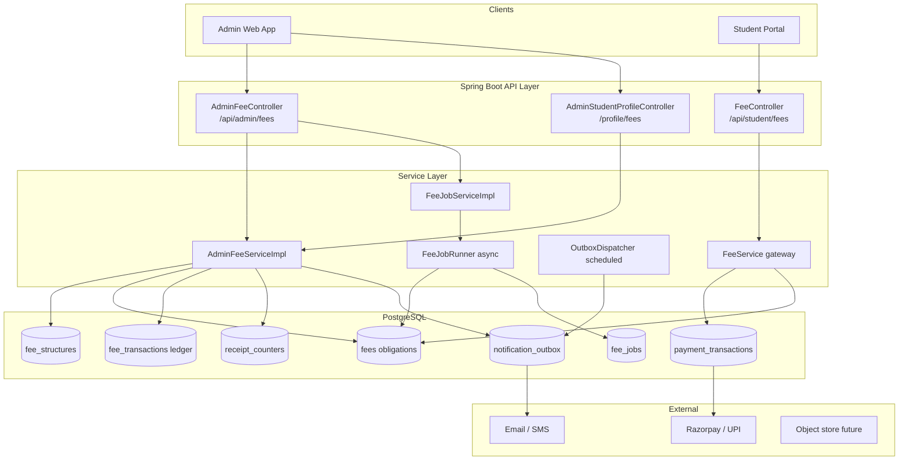
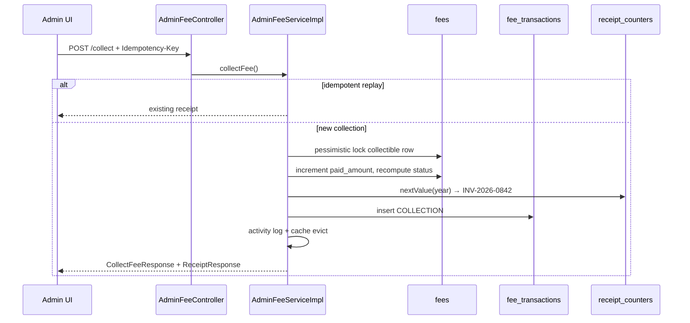
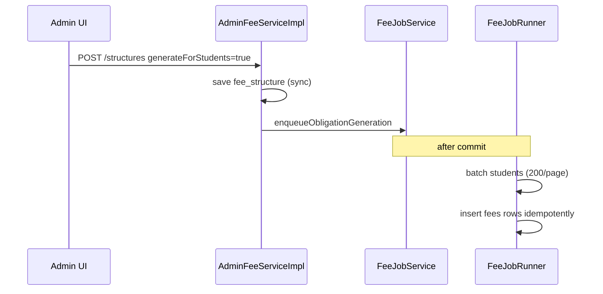
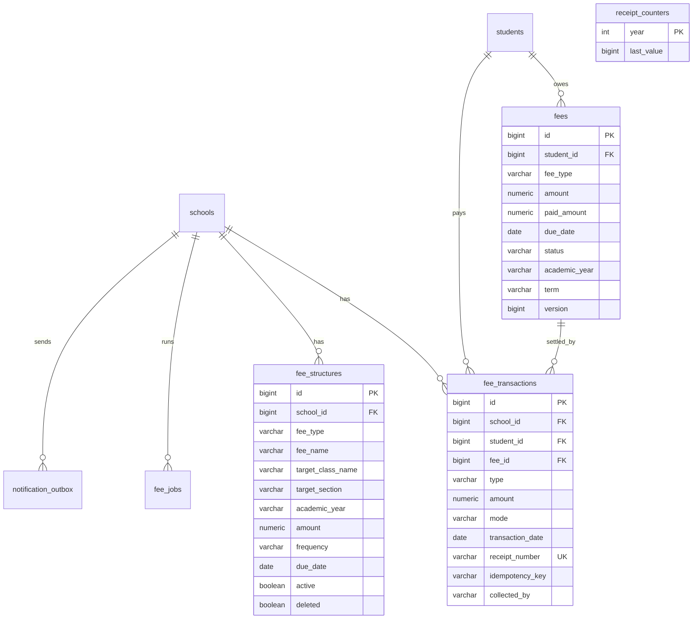

# Admin Student Fees — System Architecture

Production backend for the **InVitto Admin Portal → Student Fees** module (Figma screens: list page, collect/refund modals, receipt view, student ledger).

---

## 1. System architecture

### 1.1 High-level view



### 1.2 Design principles (startup MVP → scale)

| Principle | MVP implementation | Scale path |
|-----------|-------------------|------------|
| **Multi-tenant isolation** | Every query scoped by `schoolId` | Row-level security + JWT tenant claim |
| **Minimal schema** | Reuse `fees` for obligations; add templates + ledger only | Partition `fee_transactions` by year |
| **Correctness under load** | Optimistic lock on `fees.version`; pessimistic lock on collect/refund; idempotency keys | Redis idempotency cache; read replicas for reports |
| **Fast list page** | SQL `GROUP BY` aggregates with `HAVING` status filter | Materialized view `mv_student_fee_summary` refreshed nightly |
| **Heavy writes async** | `fee_jobs` for obligation generation + large exports | SQS/Kafka job queue + worker pool |
| **Reliable notifications** | Transactional outbox + poller | Dedicated notification service |
| **Audit trail** | `admin_activity_logs` on every mutation | Immutable event stream |

### 1.3 Domain model

Three layers of fee data:

1. **Fee Structure** (`fee_structures`) — reusable template: "Annual Tuition, Grade 10, ₹45,000, Quarterly".
2. **Fee Obligation** (`fees`) — per-student line item with due date, amount, paid amount, status.
3. **Fee Transaction** (`fee_transactions`) — immutable collect/refund ledger row + receipt number.

Status on obligations is derived:

```
if paid >= total        → PAID
else if paid > 0        → PARTIAL
else if due_date < today → OVERDUE
else                    → PENDING
```

List-page student status uses precedence: **Overdue → Paid → Partially Paid → Pending**.

### 1.4 Request flows

**Collect fee**



**Create structure (async obligation generation)**



---

## 2. File structure

```
src/main/java/com/org/careerbuilder/
├── controller/
│   ├── AdminFeeController.java          # /api/admin/fees — primary module
│   ├── FeeController.java               # /api/student/fees — online payments
│   └── AdminStudentProfileController.java  # student profile fees tab
├── dto/
│   ├── request/AdminFeeRequests.java    # CreateStructure, Collect, Refund, Export
│   └── response/AdminFeeDtos.java       # Stats, List, Receipt, Detail, Jobs
├── models/
│   ├── Fee.java                         # obligation (existing, extended)
│   ├── FeeStructure.java                # template
│   ├── FeeTransaction.java              # ledger
│   ├── ReceiptCounter.java              # atomic receipt seq
│   ├── FeeJob.java                      # async job state
│   ├── NotificationOutbox.java          # reminder queue
│   └── enums/
│       ├── FeeFrequency.java
│       ├── FeePaymentMode.java
│       ├── FeeTransactionType.java
│       ├── FeeJobType.java
│       └── FeeJobStatus.java
├── repository/
│   ├── FeeRepository.java               # aggregates, locks, school sums
│   ├── FeeStructureRepository.java
│   ├── FeeTransactionRepository.java
│   ├── ReceiptCounterRepository.java    # native upsert nextValue()
│   ├── FeeJobRepository.java
│   ├── NotificationOutboxRepository.java
│   └── projection/StudentFeeAggregate.java
├── service/
│   ├── AdminFeeService.java
│   ├── FeeJobService.java
│   └── impl/
│       ├── AdminFeeServiceImpl.java     # core business logic
│       ├── AdminFeeExportWriter.java    # Excel / CSV / PDF reports
│       ├── AdminFeeReceiptPdfWriter.java
│       ├── FeeJobServiceImpl.java
│       ├── FeeJobRunner.java            # @Async obligation + export
│       ├── FeeStatsCacheMaintenance.java
│       └── OutboxDispatcher.java        # @Scheduled reminder delivery
└── config/
    ├── CacheConfig.java                 # FEE_STATS_CACHE
    └── AsyncConfig.java                 # fee job executor

src/main/resources/db/migration/
├── V1035__admin_student_fees_module.sql
├── V1036__fee_concurrency_and_idempotency.sql
├── V1037__fee_async_jobs.sql
├── V1038__notification_outbox.sql
└── V1039__admin_student_fees_seed.sql   # Figma demo data
```

---

## 3. Database schema

### 3.1 Entity-relationship diagram



### 3.2 Tables (Flyway)

| Migration | Tables / changes |
|-----------|------------------|
| **V1035** | `fee_structures`, `fee_transactions` |
| **V1036** | `fees.version`, `receipt_counters`, `fee_transactions.idempotency_key` (unique per school) |
| **V1037** | `fee_jobs` (async obligation generation + export artifacts) |
| **V1038** | `notification_outbox` (durable fee reminders) |
| **V1039** | Demo seed: Rahul Verma ledger matching Figma |

### 3.3 Key indexes

```sql
idx_fee_structure_school   ON fee_structures (school_id)
idx_fee_txn_school         ON fee_transactions (school_id)
idx_fee_txn_student        ON fee_transactions (student_id)
idx_fee_txn_date           ON fee_transactions (transaction_date)
ux_fee_txn_idem            ON fee_transactions (school_id, idempotency_key) WHERE idempotency_key IS NOT NULL
idx_fee_student            ON fees (student_id)
idx_fee_status             ON fees (status)
idx_fee_due_date           ON fees (due_date)
```

---

## 4. API endpoints

Base path: **`/api/admin/fees`**

All endpoints require `schoolId` (query param or request body). Production: derive from JWT + `@PreAuthorize("hasRole('ADMIN')")`.

**Implemented:** `/api/admin/fees/**` is protected with `@PreAuthorize("hasAnyRole('ADMIN','SCHOOL_ADMIN')")`.
`schoolId` is derived from the JWT `schoolId` claim (via `AdminSecurityContext.requireSchoolId()`).
Request-body `schoolId` fields are stamped server-side and must not be trusted from the client.
Register admin users with `role: SCHOOL_ADMIN` or `ADMIN` and a `schoolId`.

### 4.1 List page (Figma screen 1)

| Method | Path | Purpose | Response |
|--------|------|---------|----------|
| GET | `/stats?schoolId=` | KPI cards: Collected, Pending, Overdue, This Month | `FeeStatsResponse` |
| GET | `/students?schoolId=&q=&class=&status=&page=&size=` | Paginated student fee table | `StudentFeeListResponse` |
| GET | `/filters?schoolId=` | Class / Status / Fee Type / Mode dropdowns | `FeeFilterOptionsResponse` |
| GET | `/students/search?schoolId=&q=` | Typeahead for Collect/Refund modals | `StudentSearchOption[]` |

### 4.2 Fee structures

| Method | Path | Purpose |
|--------|------|---------|
| GET | `/structures?schoolId=` | List + stats (active count, avg fee) |
| POST | `/structures` | Create structure; optional async obligation generation |
| PUT | `/structures/{id}` | Update structure |
| DELETE | `/structures/{id}?schoolId=` | Soft-delete |

### 4.3 Collect / Refund (Figma screen 2)

| Method | Path | Headers | Purpose |
|--------|------|---------|---------|
| POST | `/collect` | `Idempotency-Key` (recommended) | Record payment → receipt |
| POST | `/refund` | `Idempotency-Key` (recommended) | Reverse payment |
| GET | `/students/{id}/paid-fees?schoolId=` | | Paid fees list for refund modal |

**Collect request example**

```json
{
  "schoolId": 19,
  "studentId": 42,
  "feeType": "Tuition Fee (Q3)",
  "amount": 15000,
  "paymentMethod": "UPI",
  "paymentDate": "2026-03-02",
  "referenceNumber": "UPI982734",
  "performedBy": "Admin User"
}
```

### 4.4 Student ledger (Figma screen 3)

| Method | Path | Purpose |
|--------|------|---------|
| GET | `/students/{studentId}?schoolId=` | Header totals + Fee Breakdown + Payment History |
| GET | `/transactions/{txnId}/receipt?schoolId=` | Receipt JSON (View Receipt modal) |
| GET | `/transactions/{txnId}/receipt/pdf?schoolId=` | Download / Print PDF |
| POST | `/students/{studentId}/remind?schoolId=` | Queue fee reminder email |

### 4.5 Export & async jobs

| Method | Path | Purpose |
|--------|------|---------|
| POST | `/export` | Sync download (Excel / CSV / PDF) |
| POST | `/export/async` | Large report → returns `jobId` |
| GET | `/jobs/{jobId}?schoolId=` | Poll job status |
| GET | `/jobs/{jobId}/download?schoolId=` | Download completed export |

### 4.6 Figma → API mapping

| UI element | API |
|------------|-----|
| KPI cards (₹24,50,000 …) | `GET /stats` |
| Student table + filters | `GET /students` + `/filters` |
| Collect / Refund Fee button | `POST /collect` or `/refund` |
| View Receipt modal | `GET /transactions/{id}/receipt` |
| Download / Print | `GET /transactions/{id}/receipt/pdf` |
| Ledger page | `GET /students/{id}` |
| Remind action | `POST /students/{id}/remind` |
| Export Reports | `POST /export` or `/export/async` |
| + Create Structure | `POST /structures` |

---

## 5. Production behaviour

### Receipt numbering

Atomic per calendar year via `receipt_counters`:

```
INV-{year}-{sequence padded to 4}   →   INV-2026-0842
```

### Concurrency

- **Collect:** `SELECT … FOR UPDATE` on collectible fees for student+type.
- **Refund:** pessimistic lock on target fee row.
- **Obligation updates:** `@Version` on `fees.version` (optimistic).

### Caching

- `GET /stats` cached per `schoolId`; evicted on collect/refund.
- Scheduled full evict via `FeeStatsCacheMaintenance`.

### Idempotency

Pass `Idempotency-Key` header on collect/refund. Duplicate requests return the original receipt without double-charging.

### Notifications

Reminders write to `notification_outbox` in the same DB transaction as the audit log. `OutboxDispatcher` polls every 15s and delivers via pluggable `NotificationSender` implementations.

---

## 6. Scaling roadmap

| Stage | Users | Changes |
|-------|-------|---------|
| **MVP (now)** | 1–50 schools | Single Postgres, sync exports, in-process async jobs |
| **Growth** | 50–500 schools | Redis cache, read replica for reports, S3 for PDF/exports |
| **Scale** | 500+ schools | Partition transactions by year, dedicated payment service, CQRS summary table |
| **Millions** | Multi-region | Sharded by `school_id`, event sourcing for ledger, Stripe/Razorpay webhooks at edge |

---

## 7. Local development

```bash
# Start Postgres, then:
mvn spring-boot:run

# Demo data (after Flyway):
# Rahul Verma — Grade 10 (A), ADM2024001 — seeded by V1039

# Example calls:
curl "http://localhost:8080/api/admin/fees/stats?schoolId=19"
curl "http://localhost:8080/api/admin/fees/students?schoolId=19&page=0&size=20"
```

---

## 8. Related modules

- **Student online payments:** `/api/student/fees` + Razorpay (`FeeService`, `payment_transactions`) — separate gateway flow; future: unify successful online payments into `fee_transactions` ledger.
- **Admin student profile:** `/api/admin/students/{id}/profile/fees` — reuses fee aggregates for the profile tab.
