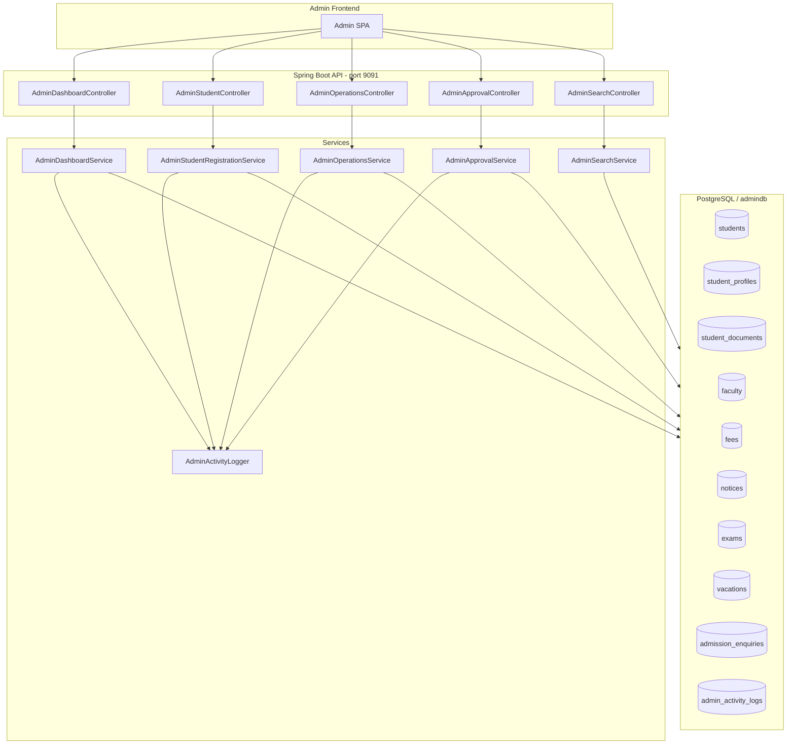
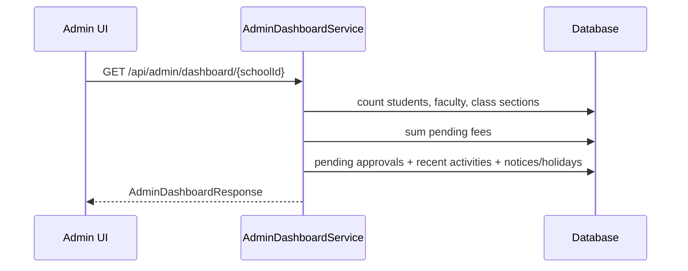
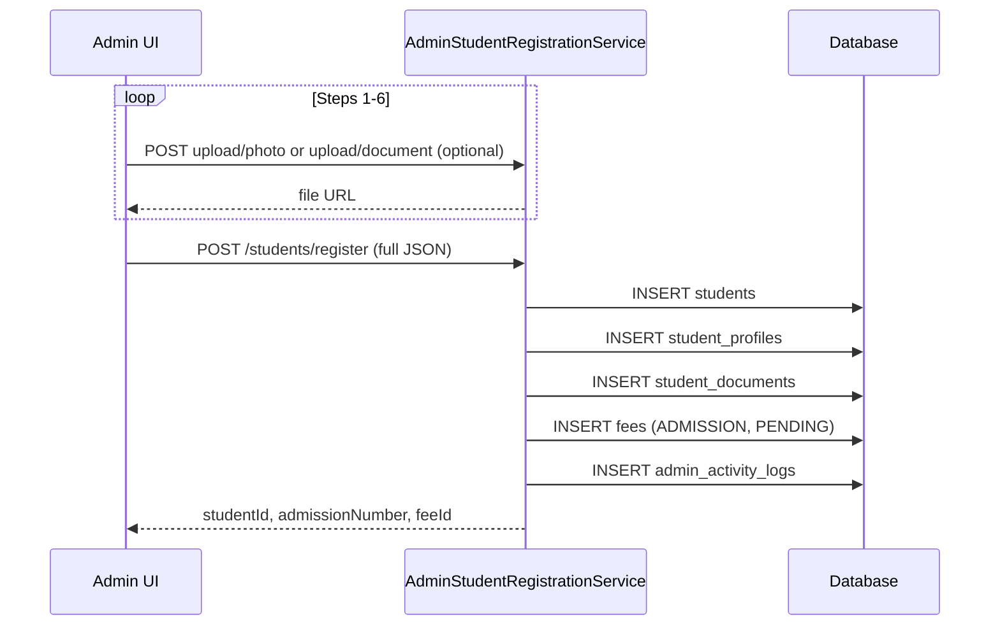
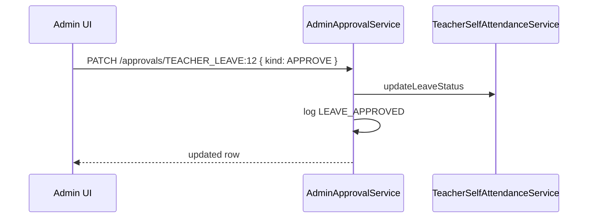

# Admin Panel — System Design

This document describes the **InVitto School Admin** backend aligned with the Figma admin dashboard and quick-action modals.

## Architecture overview



## Role model

| Role | Auth today | Target |
|------|------------|--------|
| `SCHOOL_ADMIN` / `ADMIN` | Register via `/api/auth/register` | JWT with `schoolId` claim (future) |
| Teacher / Student | Separate portals | Not admin routes |

> **Note:** Security is currently `permitAll()` on most routes. Wire `@PreAuthorize("hasRole('SCHOOL_ADMIN')")` when the admin SPA sends JWT.

## API surface

Base path: **`/api/admin`**

### Dashboard

| Method | Path | Description |
|--------|------|-------------|
| `GET` | `/dashboard/{schoolId}?academicYear=2025-2026` | Stats, greeting, quick actions, pending approvals, activity feed, notice board |

### Register Student (6-step wizard)

| Method | Path | Description |
|--------|------|-------------|
| `GET` | `/students/registration/metadata?schoolId=` | Genders, categories, class/sections, document types |
| `POST` | `/students/upload/photo` | Multipart photo → `uploads/admin/student-photos/...` |
| `POST` | `/students/upload/document` | Multipart document by type |
| `POST` | `/students/register` | **Atomic** create: `Student` + `StudentProfile` + `StudentDocument` + initial `Fee` |

### Quick actions

| Modal | Method | Path |
|-------|--------|------|
| Add Teacher | `POST` | `/teachers` |
| Create Notice | `POST` | `/notices` |
| Create Exam | `POST` | `/exams` |
| Add Holiday | `POST` | `/holidays` |
| New Admission | `POST` | `/admissions/enquiries` |

### Approvals

| Method | Path | Description |
|--------|------|-------------|
| `GET` | `/approvals/pending?schoolId=` | Teacher leave, student leave, admission enquiries |
| `PATCH` | `/approvals/{kind}:{id}` | Body: `{ "kind": "APPROVE" \| "REJECT", "rejectionReason": "..." }` |

Composite IDs: `TEACHER_LEAVE:12`, `STUDENT_LEAVE:5`, `ADMISSION_ENQUIRY:3`

### Global search

| Method | Path | Description |
|--------|------|-------------|
| `GET` | `/search?schoolId=&q=&limit=15` | Students, teachers, class sections |

## End-to-end flows

### 1. Admin opens dashboard



### 2. Register Student (all 6 steps → one submit)



**Validation highlights**

- Unique `admissionNumber`, email, phone
- Required: basic + academic + contact + parent (father name/phone)
- Roll number auto-incremented per class/section if omitted

### 3. Pending approval (teacher leave)



### 4. Create Notice

Delegates to existing `NoticeService.createNotice` → `notices` table. Audience string maps to `NoticeCategory` (e.g. "Teachers" → `ACADEMIC`).

### 5. Add Holiday

Delegates to `VacationService.createVacation` with `vacationType=HOLIDAY`, single-day `startDate=endDate`.

## Data model (new tables)

| Table | Purpose |
|-------|---------|
| `student_profiles` | Extended registration fields (Aadhar, parents, address, transport, etc.) |
| `student_documents` | Birth cert, TC, Aadhar, etc. |
| `admission_enquiries` | "Save Enquiry" pre-admission pipeline |
| `admin_activity_logs` | Recent activity widget |

**Exam extensions:** `school_id`, `class_name`, `end_date` on `exams` for admin scheduling modal.

## Reused modules

| Feature | Existing component |
|---------|-------------------|
| Notices | `NoticeService` |
| Holidays | `VacationService` (`HOLIDAY` type) |
| Student leave approval | `LeaveRequestService.updateLeaveStatus` |
| Teacher leave approval | `TeacherSelfAttendanceService.updateLeaveStatus` |
| Fees (student pay flow) | `Fee` / `FeeController` |
| Faculty CRUD | `Faculty` entity (admin Add Teacher uses simplified payload + defaults) |

## Database migration

Apply manually or via Flyway when enabled:

`src/main/resources/db/migration/V1024__admin_panel_module.sql`

Runtime also uses `spring.jpa.hibernate.ddl-auto=update` in `application.properties`.

## Frontend integration checklist

1. On load: `GET /api/admin/dashboard/{schoolId}?academicYear=...`
2. Register wizard: hold step state client-side; upload files between steps; final `POST /register`
3. Quick action modals: map to `/api/admin/teachers`, `/notices`, `/exams`, `/holidays`, `/admissions/enquiries`
4. Approval list: use `pendingApprovals` from dashboard or `GET /approvals/pending`
5. Search bar: debounce `GET /api/admin/search?schoolId=&q=`
6. Auth: send `Authorization: Bearer <token>` for `SCHOOL_ADMIN` (enforce server-side when enabled)

## Sample register payload (abbreviated)

```json
{
  "schoolId": 1,
  "basic": {
    "fullName": "Rahul Sharma",
    "admissionNumber": "GVIS-2026-001",
    "admissionDate": "2026-04-01",
    "gender": "Male",
    "dateOfBirth": "2012-05-15"
  },
  "academic": {
    "className": "10",
    "section": "A",
    "academicYear": "2026-2027",
    "studentType": "NEW_ADMISSION"
  },
  "parent": {
    "fatherName": "Mr Sharma",
    "fatherPhone": "9876543210"
  },
  "contact": {
    "phone": "9876543210",
    "email": "rahul@example.com",
    "addressLine1": "12 MG Road",
    "city": "Pune",
    "state": "Maharashtra",
    "pincode": "411001"
  },
  "documents": [
    { "documentType": "BIRTH_CERTIFICATE", "fileUrl": "uploads/admin/..." }
  ]
}
```
