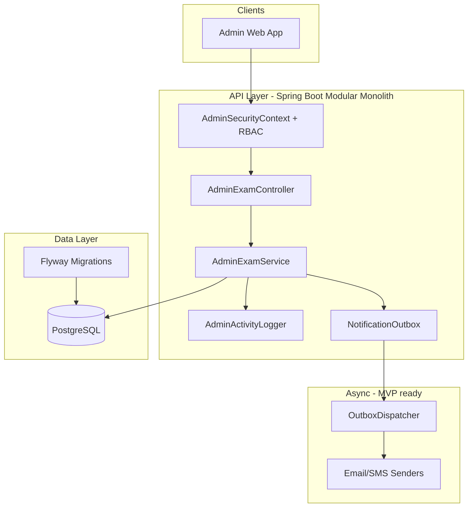

# InVitto — Admin Exams Module (Production MVP)

Architecture for the **Exams & Tests** admin experience (Figma: list, detail/timetable, assign students, publish results, export reports).

---

## 1. System architecture



### Design principles (scale path)

| Concern | MVP | Scale to millions |
|--------|-----|-------------------|
| **Tenancy** | `school_id` on every row + JWT context | Shard by `school_id` or dedicated DB per tenant |
| **Reads** | Indexed JPQL + pagination | Read replicas, Redis cache for stats/filters |
| **Writes** | Transactional bulk assign (250/batch) | Background job queue for 10k+ assignments |
| **Reports** | Sync Excel/CSV/PDF in-request | `exam_export_jobs` table + worker (same pattern as fees) |
| **Notifications** | Transactional outbox | Kafka/SQS + idempotent consumers |

---

## 2. File structure

```
src/main/java/com/org/careerbuilder/
├── controller/
│   └── AdminExamController.java          # REST /api/admin/exams
├── dto/
│   ├── request/AdminExamRequests.java
│   └── response/AdminExamDtos.java
├── models/
│   ├── Exam.java
│   ├── ExamSchedule.java
│   ├── ExamRegistration.java
│   ├── ExamVenue.java
│   └── enums/
│       ├── ExamStatus.java
│       ├── ExamType.java
│       ├── ExamRegistrationStatus.java
│       └── ExamAssignmentMethod.java
├── repository/
│   ├── ExamRepository.java
│   ├── ExamScheduleRepository.java
│   ├── ExamRegistrationRepository.java
│   └── ExamVenueRepository.java
├── service/
│   ├── AdminExamService.java
│   └── impl/
│       ├── AdminExamServiceImpl.java
│       └── AdminExamExportWriter.java
└── service/support/
    └── AdminActivityLogger.java

src/main/resources/db/migration/
├── V1041__admin_exams_module.sql
├── V1043__admin_exams_extended.sql
└── V1044__admin_exams_venues_seed.sql
```

---

## 3. Database schema

### Core tables

**exams** — examination header (per school, per academic year)

| Column | Type | Notes |
|--------|------|-------|
| exam_id | BIGSERIAL PK | |
| school_id | BIGINT | Tenant scope |
| exam_name | VARCHAR(150) | |
| class_name | VARCHAR(50) | e.g. Grade 10 |
| section | VARCHAR(10) | Optional exam-level section |
| exam_type | VARCHAR | ASSESSMENT, UNIT_TEST, MID_TERM, … |
| exam_date / end_date | DATE | Window |
| academic_year | VARCHAR(20) | AY 2025-2026 |
| status | VARCHAR(20) | DRAFT, SCHEDULED, ACTIVE, COMPLETED |
| results_published | BOOLEAN | Publish modal |
| results_published_at | TIMESTAMP | |
| deleted | BOOLEAN | Soft delete |

**exam_schedules** — per-subject timetable row

| Column | Type | Notes |
|--------|------|-------|
| schedule_id | BIGSERIAL PK | |
| exam_id | FK → exams | |
| subject_id | FK → subjects | |
| scheduled_date | DATE | |
| start_time / end_time | TIME | |
| venue_id | FK → exam_venues | Optional |
| venue | VARCHAR(200) | Denormalized name |
| invigilator_id | FK → faculty | |
| assistant_invigilator_id | FK → faculty | |
| duration_minutes, reporting_time, buffer_minutes, instructions | | Add Subject Schedule modal |

**exam_registrations** — assigned students (Students tab)

| Column | Type | Notes |
|--------|------|-------|
| registration_id | BIGSERIAL PK | |
| exam_id, student_id | UNIQUE together | |
| hall_ticket_number | VARCHAR(40) | UNIQUE per school |
| primary_venue | VARCHAR(200) | |
| status | PENDING \| VERIFIED | |

**exam_venues** — venue master + capacity

| Column | Type | Notes |
|--------|------|-------|
| venue_id | BIGSERIAL PK | |
| school_id | FK | |
| name | VARCHAR(120) | UNIQUE per school |
| capacity | INT | Default 100 |

**exam_venue_allocations** — exam ↔ venue staffing (Venue Allocation tab)

| Column | Type | Notes |
|--------|------|-------|
| allocation_id | BIGSERIAL PK | |
| exam_id, venue_id | UNIQUE together | |
| capacity_limit | INT | Optional override |
| administrator_id | FK faculty | Venue administrator |
| primary_invigilator_id | FK faculty | |
| assistant_invigilator_id | FK faculty | Optional |

**exam_registrations** (extended for hall tickets)

| Column | Type | Notes |
|--------|------|-------|
| venue_id | FK exam_venues | Seat assignment |
| document_hash | VARCHAR(40) | Verification on PDF |
| hall_ticket_generated | BOOLEAN | Distinguishes official tickets |
| portal_notified | BOOLEAN | Student portal delivery |

**exam_results** (existing) — marks per student/subject; used by export + student portal after publish.

**admin_activity_logs** (existing) — audit trail (`entity_type = EXAM`).

**notification_outbox** (existing) — async email on publish.

---

## 4. API endpoints

Base: `GET/POST/PUT/DELETE` → `/api/admin/exams`  
Auth: `ROLE_ADMIN` or `ROLE_SCHOOL_ADMIN`  
Tenant: `school_id` from JWT via `AdminSecurityContext`

### Dashboard & CRUD

| Method | Path | Description |
|--------|------|-------------|
| GET | `/stats` | Total / active / upcoming / completed counts |
| GET | `/filters` | Class, type, status, year dropdowns |
| GET | `?q=&class=&examType=&status=&academicYear=&page=&size=` | Paginated exam list |
| POST | `/` | Create exam |
| GET | `/{examId}` | Exam detail |
| PUT | `/{examId}` | Update exam |
| DELETE | `/{examId}` | Soft delete |

### Timetable

| Method | Path | Description |
|--------|------|-------------|
| GET | `/{examId}/timetable` | Subject schedule rows |
| POST | `/{examId}/timetable` | Add subject schedule |
| PUT | `/timetable/{scheduleId}` | Update schedule |
| DELETE | `/timetable/{scheduleId}` | Remove schedule |

### Venues

| Method | Path | Description |
|--------|------|-------------|
| GET | `/venues` | List active venues |
| GET | `/venues/{venueId}/availability?date=&startTime=&endTime=` | Capacity / conflicts |

### Students (assign flow)

| Method | Path | Description |
|--------|------|-------------|
| GET | `/{examId}/sections` | Sections + counts for exam class |
| POST | `/{examId}/students/preview` | Preview ALL / SECTION / INDIVIDUAL |
| POST | `/{examId}/students/assign` | Bulk assign (idempotent skip existing) |
| GET | `/{examId}/students?page=&size=` | Assigned students table |

### Hall tickets

| Method | Path | Description |
|--------|------|-------------|
| GET | `/{examId}/hall-tickets` | List tickets (student, number, venue) |
| POST | `/{examId}/hall-tickets/preview` | Preview range & count before generate |
| POST | `/{examId}/hall-tickets/generate` | Bulk numbering, hash, portal notify |
| GET | `/{examId}/hall-tickets/batch-pdf` | Printable batch PDF |
| GET | `/{examId}/hall-tickets/{registrationId}` | Preview JSON (Figma preview screen) |
| GET | `/{examId}/hall-tickets/{registrationId}/pdf` | Single-ticket PDF |

### Venue allocation

| Method | Path | Description |
|--------|------|-------------|
| GET | `/{examId}/venue-allocations` | Summary cards + allocation table |
| POST | `/{examId}/venue-allocations` | Assign venue + staff (+ optional seat distribution) |
| PUT | `/venue-allocations/{allocationId}` | Update capacity / invigilators |
| DELETE | `/venue-allocations/{allocationId}` | Remove allocation |

### Marks monitoring (admin)

| Method | Path | Description |
|--------|------|-------------|
| GET | `/{examId}/marks-monitoring` | Per-subject submission status table |
| GET | `/{examId}/marks/{subjectId}` | View marks detail + audit trail |
| POST | `/{examId}/marks/{subjectId}/approve` | Approve teacher submission |
| POST | `/{examId}/marks/{subjectId}/reject` | Reject and unlock for teacher |
| PUT | `/{examId}/marks/{subjectId}/draft` | Admin save draft / verify rows |

Submission status: `PENDING` → `SUBMITTED` (all marks locked) → `APPROVED`.

### Final results

| Method | Path | Description |
|--------|------|-------------|
| GET | `/{examId}/results/summary` | Pass %, fail %, average score |
| GET | `/{examId}/results?page=&size=` | Ranked student results |
| POST | `/{examId}/results/print` | Print Results modal (SUMMARY/DETAILED PDF) |
| POST | `/{examId}/publish-results` | Publish to students/parents (existing) |

### Results & reports

| Method | Path | Description |
|--------|------|-------------|
| POST | `/{examId}/publish-results` | Publish + optional outbox notifications |
| POST | `/{examId}/reports/export` | Excel / CSV / PDF download |
| GET | `/{examId}/activity-log` | Exam-scoped audit log |

### Example: assign all Grade 10 students

```json
POST /api/admin/exams/12/students/assign
{
  "method": "ALL",
  "defaultPrimaryVenue": "Examination Hall A"
}
```

### Example: assign by sections A & B

```json
POST /api/admin/exams/12/students/assign
{
  "method": "SECTION",
  "sections": ["A", "B"]
}
```

---

## 5. Status model

```
DRAFT → (save) → SCHEDULED | ACTIVE | COMPLETED  (derived from dates when not draft)
ACTIVE exam → results_published=true → students/parents see results (portal uses flag)
```

Registration status: `PENDING` → `VERIFIED` (future admin action).

---

## 6. Operational notes

- Run Flyway migrations before deploy (`V1041`, `V1043`, `V1044`).
- Seed data: `V1042__admin_exams_seed.sql` (school_id = 19).
- Outbox poller: `OutboxDispatcher` drains `EXAM_RESULTS_PUBLISHED` emails.
- For >5k assignments per request, switch `assignStudents` to enqueue a job (mirror `FeeJobRunner`).

---

## 7. Related modules (sidebar scope)

Students, Teachers, Classes, Fees, Leave, Notices, Certificates, and Admissions are separate bounded contexts in the same monolith, sharing `schools`, `students`, and RBAC.
